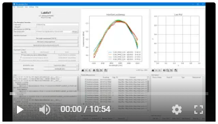

# LabExT - Laboratory Experiment Tool

[](https://www.gnu.org/licenses/gpl-3.0)
[](https://labext.readthedocs.io/en/latest/?badge=latest)
[](https://pypi.org/project/LabExT-pkg/)

[](https://doi.org/10.5281/zenodo.6602553)

LabExT, short for Laboratory Experiment Tool, is a software environment for performing laboratory
experiments on silicon-photonic devices and chips. The tool is free, written in Python 3.9 and uses the I/O API VISA
through [pyvisa](https://github.com/pyvisa/pyvisa).

More general: if you need to run measurement algorithms with SCPI-talking instruments in a laboratory, it is highly
likely that you will find LabExT useful.

## Highlights
* Execute pre-defined measurement routines using laboratory instruments at any VISA address.
  * Measurement code and instrument driver code easily extensible via their API. 
* Immediately investigate and plot the resulting data.
  * Commenting on resulting data is immediately possible after measurement.
  * A large set of meta-data is also recorded.
* Chip-scale automation with motorized stages.
  * Supports coordinate files of on-chip devices and moves stages to correct locations (e.g. for coupling fibers to on-chip grating couplers).
  * Local optical coupling optimization including Gaussian mode profile fitting.
* High Usability
  * No Python coding knowledge necessary to execute lab experiments!
  * Keyboard shortcuts!

## Video
Before losing too many words, check out the following video which demonstrates how we use LabExT in our daily work:

[](https://www.youtube.com/watch?v=5qIm3p-ml3Y "Click to watch the LabExT demo video on youtube.")

It shows the basics of single measurements and chip-level automation for optical testing.

## Links
Here are the three most important pieces of documentation you will need:

* Full documentation incl. detailed installation instructions and getting started guide: [labext.readthedocs.io](https://labext.readthedocs.io/en/latest/).
* Press F1 in the main window to open the addon documentation.
* For guidelines on how to contribute to the LabExT codebase, see [the contribution guide](./CONTRIBUTING.md).

## Installation
Assuming you use conda as environment manager, installation is straight forward:
```
conda create -n LabExT_env python=3.9
conda activate LabExT_env
pip install LabExT-pkg
```

For a detailed installation and configuration guide, please consult the [online installation guide](https://labext.readthedocs.io/en/latest/installation/).
If you plan on developing for LabExT, see the [development setup guide](https://labext.readthedocs.io/en/latest/setup_dev_env/).

## Acknowledgements & Reference
LabExT is written in part by tireless folks at the
[Institute of Electromagnetic Fields, ETH Zurich, Switzerland](https://ief.ee.ethz.ch) as part of their daily grind in
an RF and optics laboratory. Another big part is written by [Polariton Technologies](https://www.polariton.ch/) whose support and experience in
integrated optics design and the testing thereof we gratefully acknowledge.

If you use LabExT and believe that it helps you in your research as much as it helped us, consider citing us. For
your convenience, please feel free to use the provided [Bibtex](docs/labext.bib) or [ris/Endnote](docs/labext.ris)
files. This project is also archived on [Zenodo](https://doi.org/10.5281/zenodo.6602553).
