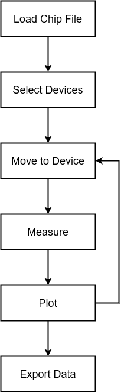
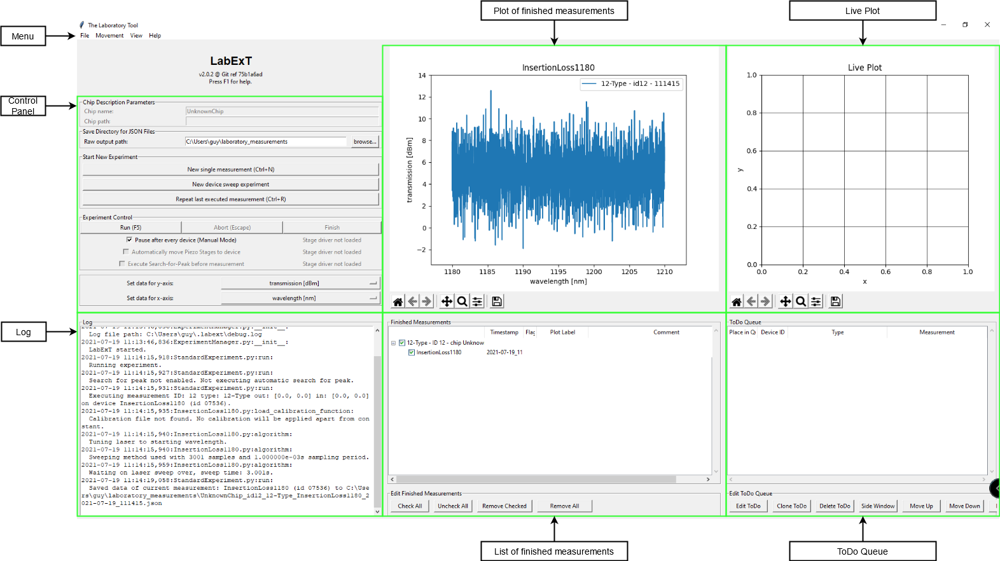
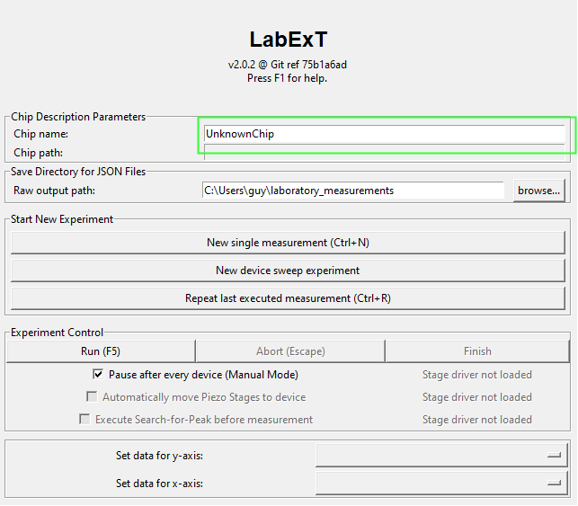
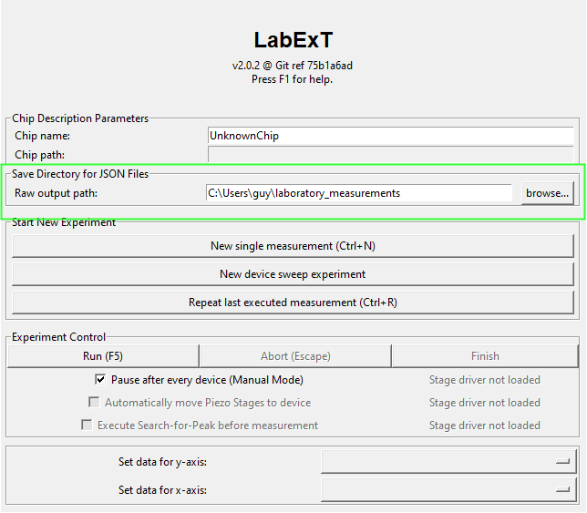
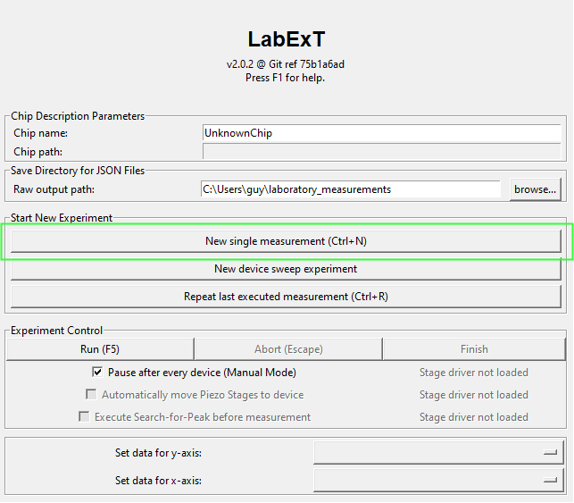
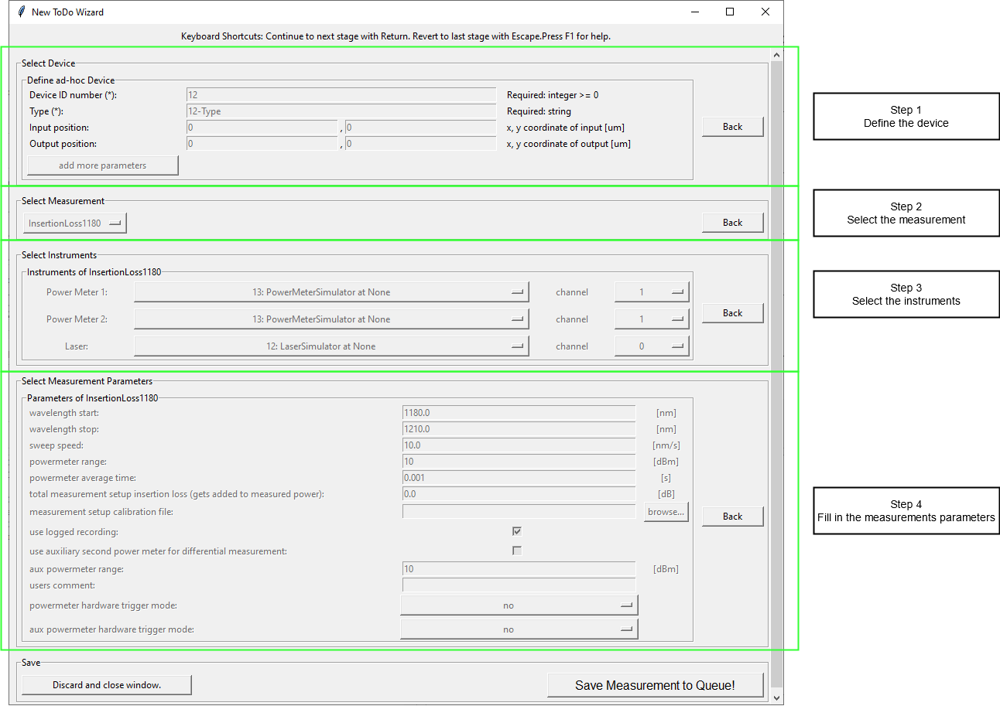
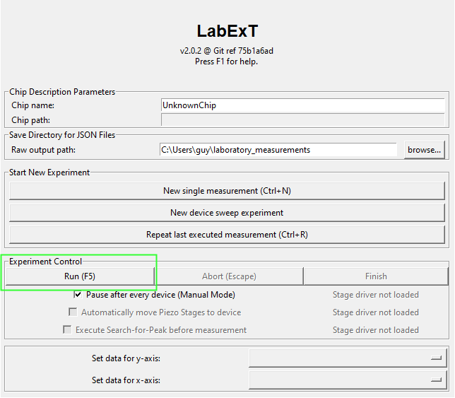
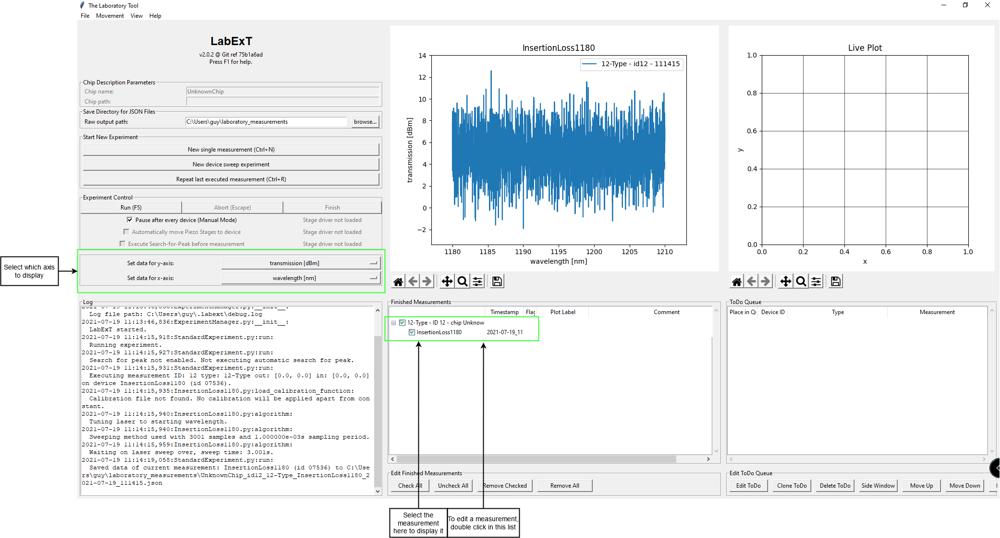
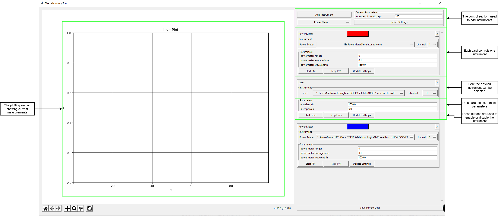

# Main Window and a First Measurement

This section serves as a small introduction to LabExT, its capabilities and how to use it effieciently. To install
LabExT properly, please follow the installation, see [here](./installation.md).

## Measurements, Instruments and the LabExT workflow

First, we would like to establish basic terminology, that is used throughout this guide.

| term        | description                                                                                                                                                                                  | example                                                                                                                                                  |
|-------------|----------------------------------------------------------------------------------------------------------------------------------------------------------------------------------------------|----------------------------------------------------------------------------------------------------------------------------------------------------------|
| Device      | Devices are structures located on a chip. Also called the DUT (device under test.)                                                                                                           | A microring resonator coupled to a wave guide with grating couplers on either side realized on a silicon-photonic chip.                                  |
| Measurement | A measurement defines a single routine or algorithm, that is run on a single device.                                                                                                         | Recording of an insertion loss curve, i.e. a laser sweeps its wavelength and the optical power after the device is recorded with an optical power meter. |
| Instrument  | Instruments are the equipment found in a laboratory, used to conduct scientific research with. These instruments are somehow connected to the computer using any VISA compatible connection. | Lasers, power meters and oscilloscopes among many others.                                                                                                |
| Experiment  | Experiments are series of measurements performed after each other, with possible automatic movement of an attached motorized stage.                                                          | Executing the same insertion loss measurement across multiple devices on a single chip.                                                                  |

### The LabExT workflow

LabExT follows a structured way to perform its automated experiments. In the flowchart below, you will find a small
overview over a possible flow of these experiments. In the following few sections we will investigate this example by
example.

## The Main Window

Once you open LabExT, you are greeted with the main window. It consists of six main elements, which are shown in the
following graphic:

### Measuring a Single Device

To measure a single device, the following steps are needed:

1. Set the chip's name
2. Select the directory to save measurement data to
3. Use the Live- Viewer to align fibers
4. Create a new, single measurement:
    1. Specify device details   
    2. Select measurement   
    3. Select instruments address and channel  
    4. Specify measurement settings
5. Press run
6. Wait for the measurement to finish
7. Plot the finished measurement and select axes
8. Add flag or comments to the finished measurement
9. Re-load previously saved measurement to inspect

#### Set the chip's name

To set the chips name, locate the 'chip name' field in the main windows control panel. Simply edit the line to change
the chip's name.

#### Select the directory to save measurement data to

This field lies underneath the 'chip name' field. Press the browse button to find the directory.

#### Use the Live- Viewer to align fibers

To start the live viewer, locate the tab 'view' in LabExT's menu. Then, select 'start live instrument view' to open the
live viewer. Use the live viewer to align the fibers correctly on the device. Consult the chapter 'Live Viewer' on how
to properly use this feature.

#### Create a new, single measurement

To create a new measurement, locate the 'New single measurement' button, or press 'Ctrl + N' on the keyboard.

Once the new window appears, fill in the information in the following order:

1) Specify device details
2) Select measurement
3) Select instrument address and channel
4) Specify measurement settings

The graphic below helps you locate the needed fields.

Finally, press the 'Save Measurement to Queue' button.

#### Press run

To run all experiments, press the run button in the control panel, or simply press 'F5'. Afterwards, wait for the
measurement to finish. If supported, you can watch the progress live in the 'Live Plot' section of the main window.

#### Select the finished measurement

To display a finished measurement, select it in the 'Select Measurements' part of the main window. In the control panel,
you can change what axis should be displayed.

## The Live Viewer

The Live- Viewer can help you with setting up and debugging of instruments. It is located in the dropdown menu 'View ->
Start Live Instrument View'. The Live- Viewer itself is grouped into two sections. To the left there is a big plot, and
to the right lies the control panel. Below you will find an explanation on how to use the Live- Viewer.

