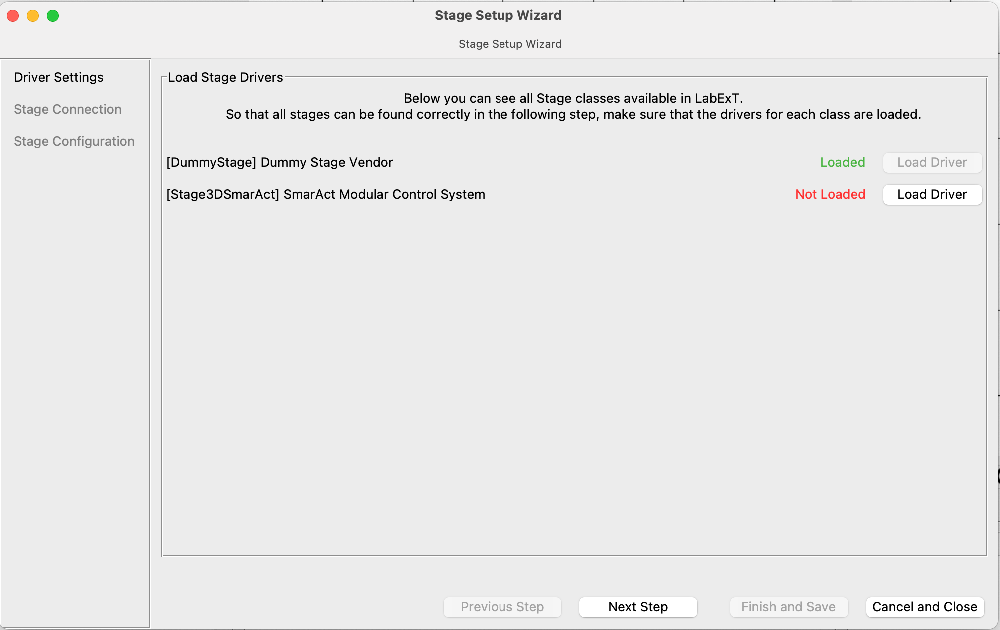
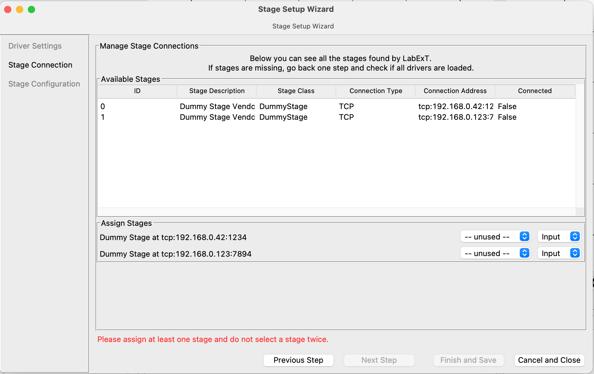
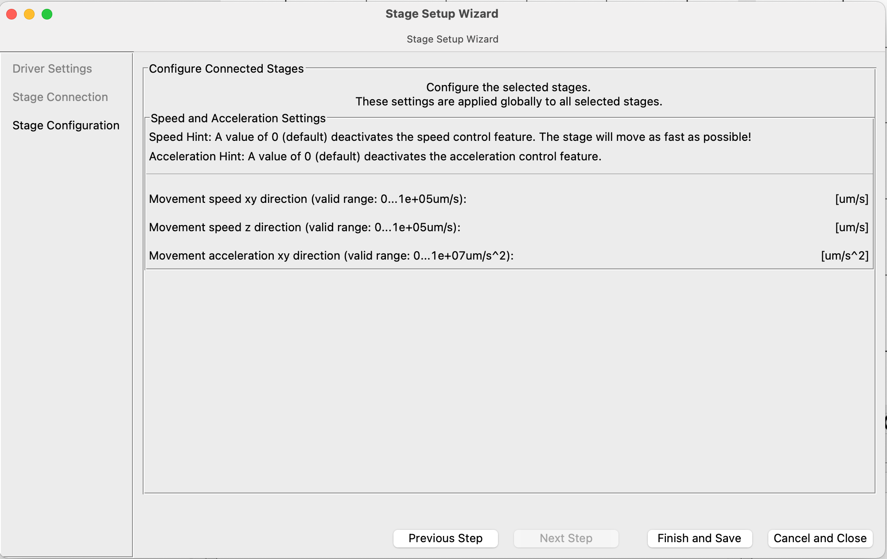

# Wizard Widget

This page describes the tkinter-GUI widget called "Wizard" which we use inside LabExT for various setup dialogs.
Check-out this page if you are interested in building small GUI addons for LabExT yourself.

## How to use the widget:
### 1. Basic settings
Create a class that inherits from `Wizard`. Call the `Wizard` constructor to set the basic settings. 
```python
from LabExT.View.Controls.Wizard import Wizard

class MyWizard(Wizard):
    def __init__(self, parent):
         super().__init__(
             parent, # required
             width=800, # Default: 640
             height=600, # Default: 480
             with_sidebar=True, # Default: True
             with_error=True, # Default: True
             on_cancel=self._cancel, # not required
             on_finish=self._save, # not required
             next_button_label="Next Step" # Default: "Next Step"
             previous_button_label="Previous Step", # Default: Previous Step
             cancel_button_label="Cancel and Close", # Default: Cancel
             finish_button_label="Finish and Save" # Default: Finish
         )
    ...
```
#### Explanation of the settings
- `width` and `height` sets the dimension of the wizard window.
-  `with_sidebar` activates the step overview of the wizard. A frame with a width of 200 is created to the right of the content, displaying the titles of all steps and highlighting the current step. 
- `with_error` activates the error display function of the wizard. When the wizard function `setError("Error: ...")` is called, the error is displayed in red above the buttons.
- `on_cancel` is the callback function that is called when the user closes the window or clicks Cancel. This method is **blocking**. The method is expected to return a bool. If the return value is True, the window is closed, otherwise it remains open.
- `on_finish` is the callback method that is called when the user clicks on Finish. This method is **blocking**. The method is expected to return a bool. If the return value is True, the window is closed, otherwise it remains open.
- `next_button_label`, `previous_button_label`, `cancel_button_label` and `finish_button_label ` are used to change the button labels.

**Note:** The `Wizard` class itself inherits from the Tkinter class `Toplevel.` Therefore, well-known functions such as `title` are available on `self`.

### 2. Define new step
To add new steps to the wizard, the method `add_step` is used. It is recommended to define the steps in the constructor of your wizard class.
```python
self.connection_step = self.add_step(
    builder=self._connection_step_builder, # required
    title="Stage Connection", # Default: None
    on_next=self._on_next, # not required
    on_previous=self._on_previous, # not required
    on_reload=self._on_reload, # not required
    previous_step_enabled=True, # Default: True
    next_step_enabled=True, # Default: True
    finish_step_enabled=False # Default: False
)
```
#### Explanation of the settings
- `builder` is the routine that builds the wizard step, i.e. defines all Tkinter objects. A Tkinter `Frame`-object is passed to the method as the first argument. All elements should use this frame as parent. The builder method is called every time the step is displayed or the wizard is manually reloaded, i.e. it is possible to render the step conditionally based on current state.
- `title` defines an optional title for the sidebar, if this has been activated.
- `on_next` is the callback method when the user clicks on "Next step". This method is **blocking**. The method is expected to return a bool. If the return value is True, the next step is loaded, otherwise not.
- `on_previous ` is the callback method when the user clicks on "Previous step". This method is **blocking**. The method is expected to return a bool. If the return value is True, the previous step is loaded, otherwise not.
- `on_reload` is called every time the step is "built", i.e. the builder method is called. This happens during step changes or when the `__reload__` method is called manually. Exemplary use: To check the current wizard state for errors:
```python
def _check_assignment(self):
    if is_stage_assignment_valid(self._current_stage_assignment):
        self.current_step.next_step_enabled = True
        self.set_error("")
    else:
        self.current_step.next_step_enabled = False
        self.set_error("Please assign at least one stage and do not select a stage twice.")
```
- `next_step_enabled ` activates the next step button. Note: This property can also be changed after the step creation (see code above).
- `previous_step_enabled ` activates the previous step button. Note: This property can also be changed after the step creation (see code above).
- `finish_step_enabled`  activates the finish button. Note: This property can also be changed after the step creation (see code above).

### 3. Define step sequence
Use the `next_step` and `previous_step` properties of the steps to define the order. Note: The order can also be changed on the fly.
```python
# Connect Steps
self.first_step.next_step = self.second_step
self.second_step.previous_step = self.first_step
self.second_step.next_step = self.third_step
self.third_step.previous_step = self.third_step
```

### 4. Define first step
To start the wizard, the first step must be defined.
```python
self.current_step = self.first_step
```

### Miscellaneous
- Use `__reload__` to reload the wizard. The method calls the builder again and updates all button and sidebar states.
- Use the `set_error(str)` method to indicate an error. Note: To reset the error, use `set_error("")`

### Screenshots



