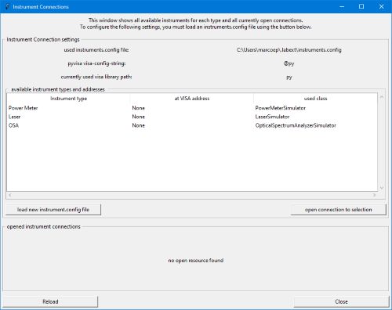
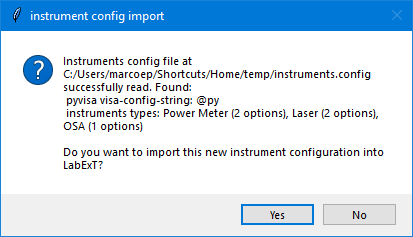
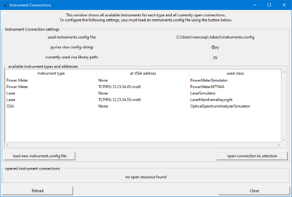
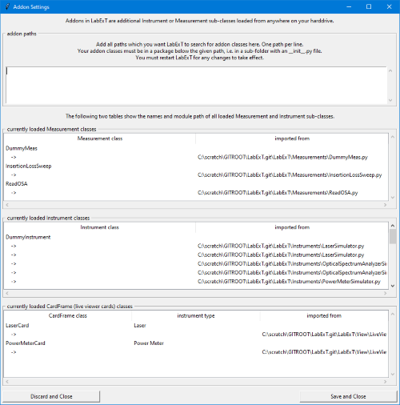
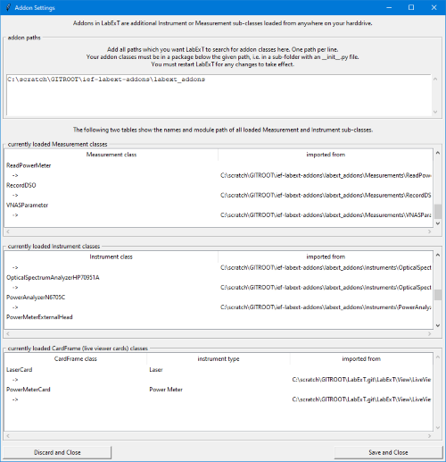
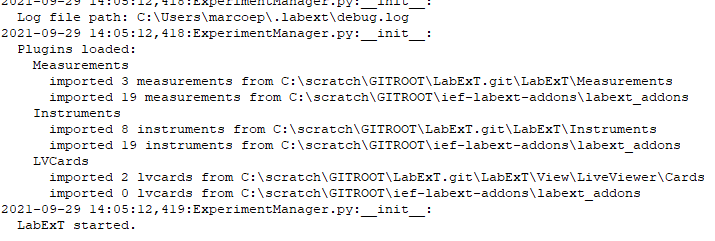
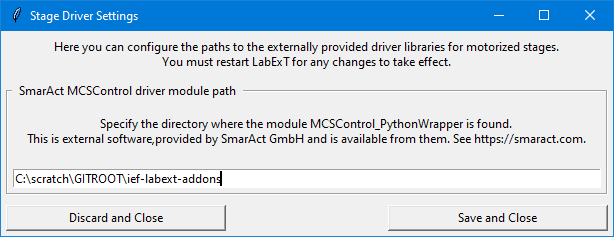

# Configuration of LabExT

To make full use of LabExT, some configuration is required. Here, we describe the most important options.

* Instrument VISA address and driver configuration. (**highly recommended** for basic functionality)
* Specify and load addon repositories. (optional, recommended if you code your own measurement and instrument drivers)
* Specify directory of SmarAct PiezoStage drivers. (optional, recommended for chip- and wafer-level automation)

!!! note
    If you just started LabExT for the first time, we suggest to go through the instruments configuration and leave the
    others for later.

## Configuration of Instruments (instruments.config)

After your first start with LabExT you will first need to tell LabExT at which VISA address is what type of instrument
and which driver is to be used. Actually, LabExT will even warn you about loading a default instruments.config file.
You can load a new config file in the menu: `Settings -> Instrument Connection Debugger`. It will open the following
window:



In the top-most section you can see where the instruments.config file is stored and information about the used VISA
library. In the table, you can see all currently known instrument configurations (which type of instrument is found at
which VISA address and which driver class is used). By default, only three software-only simulators are loaded. Click
on "load new instrument.config file", to load a new config file. 

The instruments.config file is JSON formatted and by default looks as follows with the three software-only simulators
for the three types `Power Meter`, `Laser` and `OSA`:

```json
{
    "Visa Library Path": "@py",
    "Instruments":
    {
        "Power Meter":
        [
            {"visa": "None", "class": "PowerMeterSimulator", "channels": [1,2,3,4]}
        ],
        "Laser":
        [
            {"visa": "None", "class": "LaserSimulator", "channels": [0,1,2,3,4]}
        ],
        "OSA":
        [
            {"visa": "None", "class": "OpticalSpectrumAnalyzerSimulator", "channels": []}
        ]
    }
}
```

We show by example to add one of your laboratory instruments with a VISA address. We assume, we have these two
instruments available:

* A 4-port [Keysight N7744A optical power meter](https://www.keysight.com/ch/de/product/N7744A/optical-multiport-power-meter-4-sensor-ports.html) connected at the IP address 12.23.34.45
* A 5-channel [Keysight 8164B laser](https://www.keysight.com/ch/de/product/8164B/lightwave-measurement-system.html) connected at the IP address 12.23.34.55

Luckily, LabExT has the driver classes already included for these two instruments. For other instruments, you will have
to write your own driver class, see [the Instrument driver How-To](code_new_instr_example.md) section.

To start, copy the instruments.config file (for path, see the settings dialog) to some other location and edit the file
as follows:

Add the two following line to the `"Power Meter"` section:
```json
{"visa": "TCPIP0::12.23.34.45::inst0", "class": "PowerMeterN7744A", "channels": [1, 2, 3, 4] }
```
and this line to the `"Laser"` section:
```json
{"visa": "TCPIP0::12.23.34.55::inst0", "class": "LaserMainframeKeysight", "channels": [0, 1, 2, 3, 4] }
```

!!! important
    For each individual instrument description, the required keys are: the VISA-Adress of your instrument (`'visa'`),
    the class name (`'class'`) and the available channels (`'channels'`). If the instrument does 
    not have different channels then pass an empty list. Using the `'args'` key, you can pass additional arguments which you 
    will then be able to access from `**kwargs` passed to the instrument driver's constructor.
    This could for example be a custom timeout or gpib adress. The following example gives a quick impression:
    ```
    {"visa": "TCPIP::SOMETHING::1234::INSTR", "class": "SomeInstrumentClass", "channels": [], "args": {"gpib_addr": 10, "net_timeout_ms": 50000} }
    ```

so the final JSON file looks like this:
```json
{
    "Visa Library Path": "@py",
    "Instruments":
    {
        "Power Meter":
        [
            {"visa": "None", "class": "PowerMeterSimulator", "channels": [1,2,3,4]},
            {"visa": "TCPIP0::12.23.34.45::inst0", "class": "PowerMeterN7744A", "channels": [1, 2, 3, 4] }
        ],
        "Laser":
        [
            {"visa": "None", "class": "LaserSimulator", "channels": [0,1,2,3,4]},
            {"visa": "TCPIP0::12.23.34.55::inst0", "class": "LaserMainframeKeysight", "channels": [0, 1, 2, 3, 4] }
        ],
        "OSA":
        [
            {"visa": "None", "class": "OpticalSpectrumAnalyzerSimulator", "channels": []}
        ]
    }
}
```

!!! attention
    Don't forget to add the `,` after the existing lines in the instrument lists as required by the JSON syntax.

Save the file and load it by clicking the "load new instruments.config file"  button. After locating the new file, and
clicking Open, LabExT tries to interprete the file (it will tell you if you made a JSON formatting error). If
successful, LabExT tells you what it found in the file:



Click Yes. After a restart of LabExT and starting the Instrument Connection Debugger again, you should now see the two
instruments added next to the three simulators:



Now, you will be able to run measurements using these instruments.

!!! hint
    We suggest you store the instruments.config file in a place where it is accessible by all your laboratory users,
    as this file represents physical and network configurations which is useful for everyone and tends to change
    only seldomly.

After adding the instruments configuration, you are now ready to
[run your first measurement](./first_simple_measurement.md).

### Detailed Configuration of VISA Addresses and Library Path

We use [pyvisa](https://github.com/pyvisa/pyvisa) as package to communicate with the instruments. We warmly recommend
[their documentation](https://pyvisa.readthedocs.io) for you to check:

1. [What VISA addresses are supported](https://pyvisa.readthedocs.io/en/latest/introduction/names.html)
2. [and how to configure the used visa library.](https://pyvisa.readthedocs.io/en/latest/introduction/configuring.html)

By changing the `VisaLibraryPath` variable in the instrument configuration, you can select which visa library should be
used (by default [pyvisa-py](https://github.com/pyvisa/pyvisa-py) is used, indicated by a `@py`). If you want to use
another VISA library (as could be beneficial for instruments attached by GPIB), simply change this variable to the path
where the `visa.dll` or `visa.so` file is located. As an example, to use the NI VISA library in its default
installation directory, change it to:
```json
    "Visa Library Path": "C:\\Windows\\SysWOW64\\visa32.dll",
```
!!! attention
    Don't forget the double-backslash on Windows systems, otherwise Python does not read the path correctly.

## Specify Addon Directories

Addons to LabExT extend its functionality by adding measurement routines or instrument drivers:

* For your measurement classes to be recoginzed as an Addon to LabExT, they MUST be a subclass of Measurement(`LabExT.Measurements.MeasAPI.Measurement`). See [the Measurement How-To](code_new_meas_example.md) and [the Measurement API docu](code_standalone_meas.md).
* The same goes for instrument classes: they must be a subclass of Instrument (`LabExT.Instruments.InstrumentAPI.Instrument`). See [the Instrument driver How-To](code_new_instr_example.md) and [the Instrument API docu](code_API_overview.md).

These classes must reside in a Python package (a folder with an `__init__.py` file) so LabExT can load them. To make
these classes accessible to LabExT, specify the addon loading locations in the menu `Settings -> Addon Settings`.

By default, the dialog shows the following classes available in LabExT by default: 3 measurement classes, 8 instrument
drivers, and 2 LV cards (extensions to the live viewer feature). In the respective tables, the paths to the Python
files from where these classes are loaded are also shown for debugging reasons.



To make LabExT load your own addons from anywhere else on your file system, add the path to the folder containing your
Python package with the addon classes into the top-most textbox. After clicking "Save and Close" and restarting LabExT,
the Addon Settings dialog should now show the recognized classes and the respective file path. My dialog looks as
follows:



Also, LabExT will print statistics on Addon-loading in the Log after startup:




## Specify SmarAct Driver Directory

For chip- or wafer-scale automation with motorized stages, you need to tell LabExT the path to the the driver package
offered by [SmarAct GmbH](https://www.smaract.com) for your stages. Currently, LabExT works only with 3-DOF linear
stages (pull requests welcome!). If you have such stages, you should have received the Python drivers with them.
Currently tested and working is MCS driver version 2.0.24.

To tell LabExT where to find them, use the menu: `Settings -> Stage Driver Settings` and input the path to the folder
where the `MCSControl_PythonWrapper` package is located. My settings look like:



After clicking "Save and Close" and restarting LabExT the drivers should be available. 

!!! check
    If the "Could not load piezo-stage driver. All movement through LabExT will be deactivated." warning is not
    displayed in the Log of LabExT after startup then you succeeded.
