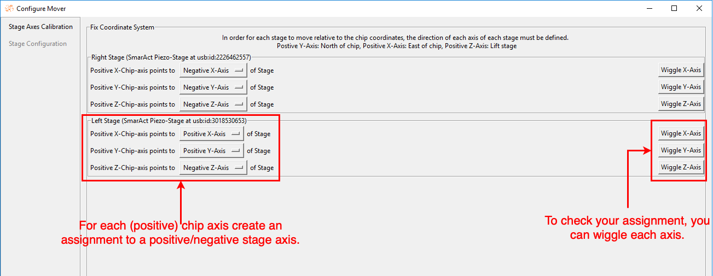

# Mover Setup: Automatically Move Stages

LabExT allows you to chain multiple measurements of different devices on a chip or wafer by automatically moving
electrical and optical contact probes between devices under test. This is commonly called chip- or wafer-scale
automation. If you mount either the chip or the contact probes on motorized positioners and supply LabExT with a set of
coordinates of the devices on your chip, LabExT takes care of calibration, movement, and automation of a chain of
measurements. LabExT is capable of safe and collision-free movement of electrical or optical probes to your device
under test and a local optical coupling optimization. LabExT also implements the necessary calibration routines to align
chip/wafer coordinates to the stage coordinates with a focus on ease-of-use.

This can for example be very helpful for a first screening of many devices contacted by some electrical probes and
optical fibers to grating couplers before doing in-depth analysis of a few of them.

At the time of writing, LabExT supplies drivers for use with
the [SmarAct MCS2 systems](https://www.smaract.com/en/control-systems-and-software/product/mcs2)
for up to 3 channels per stage (e.g. a x-y-z-stage). Drivers for LabExT for connecting motors of different vendors can
be added via addon-loading when implementing a basic minimum interface.

Before you continue, make sure LabExT is installed correctly; more [here](./installation.md).

## Calibration States, Terminology and Setup Workflow

### Terminology

Before we start, we introduce the different terminologies used in this section. We start with the driver of the
motorized stage and ascend the levels of abstraction:

| Term          | Description                                                                                                                                                                                                                                                                         | Example                                                                                                                                                      |
|---------------|-------------------------------------------------------------------------------------------------------------------------------------------------------------------------------------------------------------------------------------------------------------------------------------|--------------------------------------------------------------------------------------------------------------------------------------------------------------|
| Stage Driver  | The stage driver is a piece of software responsible for the correct (low-level) communication with physical stages in the lab. Typically it is provided by the manufacturer and can include an interface to Python.                                                                 | The manufacturer SmarAct offers a Python interface to the MCS2 control system. This includes functions to control the Stage through a Python script.         |
| Stage         | A Stage is LabExT's abstraction of a physical Stage in the lab. Each stage supported by LabExT must have an implementation; more about this [here](./code_API_mover.md#stages). The goal is to control stages from different vendors through a unified interface.                   | Stages of SmarAct with the MCS2 control system version 1 can be controlled with the class `Stage3DSmarAct`.                                                  |
| Calibration   | A calibration contains all information needed to move a stage safely. Depending on the calibration state (see [here](#calibration-states)), more or fewer functions are available. The goal is to have all stages move in the same coordinate system given by the chip coordinates. | A stage with a valid coordinate transformation from its coordinate system to the chip's coordinate system allows absolute safe movement in chip coordinates. |
| Path Planning | A path-planning algorithm can move one or more stages from start to target coordinates in the chip coordinate system. They iteratively calculate trajectory waypoints for each stage.                                                                                               | The `CollisionAvoidancePlanning` algorithm calculates the collision-free path of several stages from start to finish points.                                 |
| Mover         | The Mover is the entry point for all movements in LabExT. It manages all defined calibrations and connected stages. Using path-planning algorithms allows the movement of several stages at once.                                                                                   |                                                                                                                                                              |

### Calibration States

Each stage can be in different states of calibration. Depending on the state, different functions are available for each
calibration. The states are ordered. A higher state always guarantees the conditions and abilities of the lower
states.

| State                            | Description                                                                                                                          | Actions available                                                                                                                                                                               |
|----------------------------------|--------------------------------------------------------------------------------------------------------------------------------------|-------------------------------------------------------------------------------------------------------------------------------------------------------------------------------------------------|
| 0  `UNINITIALIZED`           | Initial state after the stage driver is loaded into LabExT.                                                                          | Establish connection to Stage.                                                                                                                                                                  | 
| 1  `CONNECTED`               | A connection to the stage was established successfully, and the stage responds to commands.                                          | Movement of the stage (relative and absolute) in stage coordinates, change settings (e.g. acceleration, speed), reading of the position in stage coordinates, and disconnection from the stage. |
| 2  `COORDINATE SYSTEM FIXED` | A mapping has been defined to link stage coordinate axes to chip coordinate axes. This assumes perfect parallel stage and chip axes. | The stage allows relative movement in chip coordinates.                                                                                                                                         |
| 3  `SINGLE POINT FIXED`      | A single chip coordinate was paired with a stage coordinate.  However, we still assume perfectly parallel chip and stage axes.       | The stage can move absolutely in chip coordinates and return the position of the stage in chip coordinates.                                                                                     |
| 4  `FULLY CALIBRATED`        | Three coordinate pairings have been defined. An accurate transformation from chip to stage system and vice versa was defined.        | The Stage can accurately move in the chip system absolutely and return the position in the chip system. A full 3D coordinate transformation is applied for highest precision.                   |

LabExT currently supports calibrating 3 degrees-of-freedom per stage to a 2 degrees-of-freedom chip coordinate
system. Mathematically, we make use of the [Kabsch algorithm](https://en.wikipedia.org/wiki/Kabsch_algorithm) to
calculate the optimal rotation matrix between each stage and chip coordinate systems. The algorithm assumes rigidity,
i.e. 1um in stage coordinates is 1um in chip coordinates.

## Complete Mover Setup Workflow

To fully configure LabExT's mover to allow automatic movement of connected stages, three wizards are available to set
various aspects of the mover. The following flow diagram shows the dependencies of the wizards.

In the [**Configure Stages**](#1-configure-stages) wizard, you can select which stages found on the PC should be used.

After selecting and connecting the stages, optional settings for speed, acceleration, etc., can be made in the [**Setup
Mover**](#2-setup-mover) wizard. Without adjustments, these values will be set to reasonable default values.

Finally, in the [**Calibrate Stages**](#3-calibrate-stages) wizard, the automatic movement of the stages by correct
position in space is established.

### 1. Configure Stages

This wizard is used to select found stages for further use in the Mover.

1. Click on "Movement" > "Configure Stages ..." in the context menu.
2. In the wizard step "Driver Settings" all stage driver implementations are displayed. These are loaded from LabExT 
   Core and Addon Paths.
   Make sure that the stage you want to use has an implementation and its drivers are loaded. If not, check
   [Troubleshooting](#troubleshooting). Click "Next Step".
   
3. In the "Stage Connection" wizard step, found stages are selected for later use. For this purpose, an orientation,
   device port, and stage type must be specified for each stage. No two stages can have the same orientation or device
   port.
    - The **Orientation** indicates from which side the stage is accessing the chip in the chip
      plane. [This diagram](./img/LabExT_Stages_Orientation.png) may help in the selection process.
    - The **Device Port** assigns an input or output port to each stage. Based on this information, the stage will move
      to either the input or output coordinates of a device during automatic moving.
    - The **Stage Type** is used to indicate what tool is attached to your stage. This corresponds to the available
      [Polygon](./code_API_mover.md#stage-polygons) classes in LabExT.
      

4. Define properties for the stages and the assigned polygons. The polygons give the stage a physical outline which is
   used during the path finding algorithm to make sure the stages don't touch. By default, LabExT assumes single mode
   fibers with 125um cladding diameter. Please see [this guide](./code_API_mover.md#stage-polygons) to extend LabExT
   with your stage type and define the outlines of your own tool.
   

Click on "Finish Setup". The connection to the stages is established.

After completing the wizard, you will find a list of your previously selected stages in the "Movement" menu in the menu 
bar, along with the current status of the stages. The overall status of the mover is also displayed. If everything went
without problems, all stages and the Mover are in `COORDINATE SYSTEM FIXED` status.

### 2. Setup Mover

This wizard allows you to make global settings in the Mover. At least one connected stage must exist (i.e., the mover
state is at least `CONNECTED`) to change the settings.

!!! note  
    The setup mover step is optional. All stages automatically get the same settings. In addition, all settings are
    stored on the PC. A later LabExT start will restore earlier settings and automatically set them to new Stages.

1. Click on "Movement" > "Configure Mover..." in the context menu.
2. The values can be adjusted and saved in the wizard with a click on "Save".
   

Setting the values does not lead to a change of state of the stages or the mover.

!!! warning
    Familiarize yourself with the meaning of possible edge cases of your stage. For example, a speed of 0 um/s and
    acceleration of 0 um\s^2 for SmarAct Stage means disabling the control feature.
    They will then move as fast as possible!

### 3. Calibrate Stages

This wizard calibrates all stages in the coordinate system of the imported chip and thus allows moving all stages in 
relation of the chip (and hence device) coordinates.
At least one connected stage must exist (i.e., the mover state is at least `CONNECTED`) to calibrate stages.

1. Click on "Movement" > "Calibrate Stages..." in the menu.
   2. In the first wizard step, "Stage Axes Calibration" the stage axes are adjusted to the chip axes.
      Goal: Due to the design of the lab setup of your experiment, stage axes, and chip axes may not align (e.g. positive 
      chip x-axis points to negative y-axis of stage).
      After this calibration, the stage and chip axes are matched and all stages can move relatively in the chip coordinate
      system.
      

      To check the axes' assignment, you can wiggle each axis by pressing the respective button. When wiggling, the stage
      first moves 1mm in the positive direction of the assigned chip axis and then 1mm in the negative direction.

!!! warning
    Wiggling stages will trigger actual movement of stage axes! Make sure that the stage is free to move in all
    directions to avoid crashes with your sample or other obstacles!

Click on "Next Step" to confirm the settings. The stages are in `COORDINATE SYSTEM FIXED` status.

Example: Most often, axes are inverted. This corresponds, e.g., to an assignment of the positive Z-chip axis to the
negative Z-stage axis.

This diagram shows an example of a rotation of the axes in 2D space:

!!! note
    This calibration only needs to be performed once per PC. The assignments are stored on the PC and automatically
    restored for the respective stage. Be sure to repeat the calibration when you change your setup.

3. The next step is to perform the full calibration. For this purpose, coordinate pairs are defined. These pair a 3D
   point in the stage coordinate system with a 3D point in the chip coordinate system.
   These pairings allow the calculation of a transformation between the systems and, thus, the safe movement of all
   stages.
4. Make sure that a chip has been imported. If not, no pairing can be created.
5. Click on "New Pairing..." to create a new pairing.
6. Select a device from the list to be used for pairing. Click "Select marked device" to confirm the selection.
7. Move the stages to the device and achieve an optimal coupling. Make sure to move each stage to the correct device
   port that you assigned in the Configure Stages wizard (i.e. input stage couples to input port of device...)
    1. Use the Live Viewer and the Search For Peak algorithm to optimize the position.
       Note that the displayed position of the stage is updated continuously.
    2. Click "Save and Close" to confirm the pairing.

   
8. After the first pairing for each stage, the status changes to `SINGLE POINT FIXED`. The stages can move approximated
   in the chip coordinate system.
   Repeat step 7 to get at least 3 pairings. This creates an exact transformation between chip and stage system.

!!! hint
    If a stage with which a new pairing is to be made can move absolutely in the chip system (i.e., has at least the
    state `SINGLE POINT FIXED`),
    the user is offered the possibility to move to the device of the new pairing.
    Note that this is only an approximation until the third pairing is created.

9. After at least 3 pairings have been created for each stage, all stages and the mover are in the highest
   state `FULLY CALIBRATED`.
   The Mover can safely move the Stages to Devices. Click on "Finish Setup" to finish the wizard.

   

When completed, the calibrations are saved to disk for recovery.

## Mover Setup Recovery

LabExT automatically saves all Mover settings to the hard disk of the computer.
These are used to automatically restore settings after a LabExT restart.

### Stage Calibrations

The axes calibration (step "Stage Axes Calibration" in the [Calibrate Stages](#3-calibrate-stages) wizard) is stored in 
the LabExT folder.
The corresponding axis assignments are stored for each stage identifier (e.g., `usb:id:2226462557` of a SmarAct
piezo stage).
The saved assignment is automatically applied if a new stage is added in the "Configure Stages" wizard step with the
same identifier.
There's no need for user interaction here. Note, however, that if the lab setup is changed, the calibration may need to
be adjusted.

The complete calibration is stored in the file `mover_calibrations.json` and is used to restore the calibration after
a restart of LabExT while keeping the experiment setup the same. The calibrations are chip position dependent, which 
means that saved calibrations can only be restored if the chip is the same after the restart.

#### Calibrations are restored as follows:

1. Import the chip file with which the calibration was made. Make sure that the chip is named the same.
2. A dialog appears that a calibration with the chip name and a creation time was found. Click "Yes" to start the
   recovery.

   

3. In the following dialog, select which stage should be assigned to which calibration. Then, click "Apply calibrations"
   to complete the restoration.

   

## Path Finding and Collision Avoidance

The LabExT Mover uses several algorithms to move multiple stages safely from start to destination coordinates
potentially.

!!! hint
    Would you like to extend LabExT with a new path-finding algorithm?
    You can follow this [guide](./code_API_mover.md#path-planning-algorithms) to implement a new algorithm.

### Single Stage Algorithms

The [Single Stage Planning](https://github.com/LabExT/LabExT/blob/dev/LabExT/Movement/PathPlanning.py) is used when only
one stage is registered.
The simple algorithm moves directly from the start to the destination coordinates.
However, the Z-difference between the start and destination is taken into account.
As a result, the stage moves up far enough (positive Z) to avoid a possible crash with the chip.

### Collision-Free Algorithm

The [Collision Avoidance Planning](https://github.com/LabExT/LabExT/blob/dev/LabExT/Movement/PathPlanning.py) uses at
least two stages
and calculates a collision-free path of all stages from start to finish coordinates.
Optimization steps are performed on a potential field. A polygon must approximate each stage.
Use [this guide](./code_API_mover.md#stage-polygons) to support new polygons in LabExT.

## Troubleshooting

### My stage class is not displayed in the *Configure Stages* Wizard.

LabExT loads all stage implementations in LabExT Core from
the [`Stages`](https://github.com/LabExT/LabExT/tree/dev/LabExT/Movement/Stages) subfolder.
Then, further implementations are loaded via the add-on paths. To change them, open `Settings -> Addon Settings` and
check under "currently loaded Stage classes" if your stage class was found and imported.
Note that if your class has the same name as one in LabExT Core, the one in Core has priority.
Also, note that the class must inherit from `LabExT.Movement.Stage.Stage` and implement the interface correctly; more
about this in [this guide](./code_API_mover.md#stages).
Also, restart LabExT after making changes to the classes and add-on settings.

### The driver of my Stage class is still displayed as *not loaded*.

Check the LabExT logs for possible incorrect paths. Also ensure potential externally available driver classes (linked 
libraries, UART drivers, etc.) have been installed on the PC and restart LabExT.

### My stage is not found in *Stage Connection* wizard step.

Make sure that the stage is turned on and connected to the PC.
Also, check that a stage implementation is loaded that can communicate with this stage.
Finally, ensure all drivers and third-party software about the stage exist in LabExT
and have been installed on the PC. Restart LabExT if any of these items have changed.

### My stage type is not supported or is not in the dropdown menu.

Possibly there is no implementation for this stage type. Follow [this guide](./code_API_mover.md#stage-polygons) to
create an implementation.

### My stages do not move when I want to move to a Device.

Check the LabExT logs. If the error "Path-finding algorithm makes no progress." was thrown,
the path-finding algorithm could not calculate a safe path.

If the stages did not move at all (or only minimally) apart from the Z-lift, the settings of the stages could be
incorrect, so the polygons overlap by mistake.
Make sure that the orientation of the stages defines the direction of the polygons in space.
Make sure that all orientations are correct with respect to the chip space.
Further, check if the selected safety distance is not too large.
To change these points, visit [*Configure Stages*](#1-configure-stages) again.

If the stages move but still need to complete the path to the destination,
check if the safety distance is too large.
Also, ensure that the stages' input and output are not reversed.
If this is the case, the stages could cross each other, which the algorithm prevents.